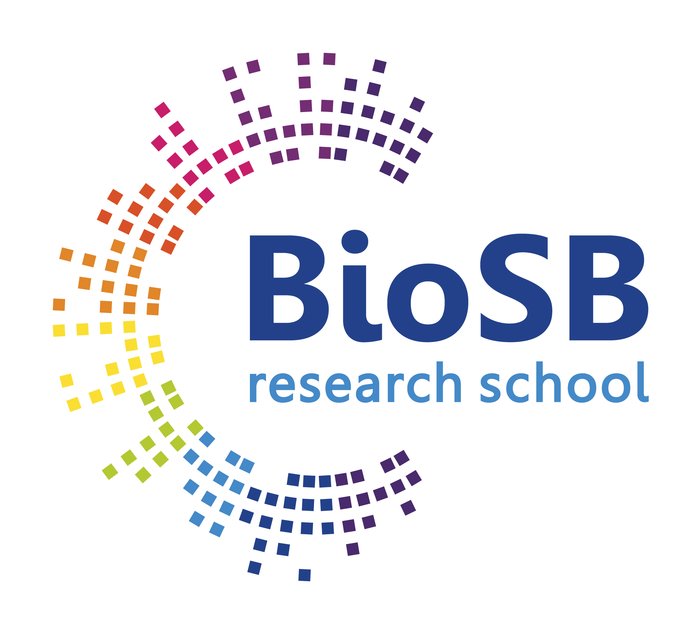

[![CC BY 4.0][cc-by-shield]][cc-by]

[cc-by]: http://creativecommons.org/licenses/by/4.0/
[cc-by-shield]: https://img.shields.io/badge/License-CC%20BY%204.0-lightgrey.svg

# BioSB Summer School on Advanced Machine Learning and AI for Life Sciences – 2026

We are thrilled to announce the upcoming BioSB Summer School on Advanced Machine Learning and AI for Life Sciences. Set in the beautiful forests surrounding De Werelt in Lunteren, The Netherlands, the programme runs from Sunday August 23 (end of afternoon) – Thursday August 27 2026. 

The summer school is an intensive four-day programme (Monday–Thursday, single track) designed for researchers who are ready to go beyond the basics and engage with the cutting edge of AI and ML in the life sciences. Participants arrive on Sunday afternoon for a welcome dinner and to settle in before the programme begins on Monday morning. The programme strikes a 50/50 balance between theory and hands-on practice, ensuring participants not only understand modern methods but can apply them. The computational and methodological depth is central; biology serves as the motivating context throughout. See the [course website](https://www.dtls.nl/courses/biosb-summer-school-on-advanced-machine-learning-and-ai-for-life-sciences-2026/) for more information and the [schedule](https://www.dtls.nl/schedule-biosb-summer-school-on-advanced-machine-learning-and-ai-for-life-sciences-2026/).

## Background material

Here is some material that you can use in preparation for the summer school.

### General
For those who need a refresher of their knowledge on linear algebra, probability theory or machine learning, have a look at (part of) the following chapters of the [Deep Learning book](https://www.deeplearningbook.org/) by Goodfellow, Bengio and Courville:
  * [Linear algebra](https://www.deeplearningbook.org/contents/linear_algebra.html): section 2.1-2.8 (pp. 29-43)
  * [Probability theory](https://www.deeplearningbook.org/contents/prob.html): section 3.1-3.8 (pp. 51-60)
  * [Machine learning](https://www.deeplearningbook.org/contents/ml.html): section 5.1-5.3 (pp. 96-120)

### Generative models - Tuesday 25 August
For Tuesday's hands-on session some background on graph neural networks is useful. These will only briefly be explained in the morning lecture. Therefore, please have a look at the following resources/papers before this session:
   * [A Gentle Introduction to Graph Neural Networks](https://distill.pub/2021/gnn-intro/): definitely have a  close look at this one
   * [Semi-Supervised Classification with Graph Convolutional Networks](https://arxiv.org/abs/1609.02907): complicated paper, it's okay if you only grasp the main gist of it
   * [De novo design of protein structure and function with RFdiffusion](https://www.nature.com/articles/s41586-023-06415-8): 

### Multimodal learning - Wednesday 26 August
On Wednesday we will end with a journal club on a recent paper using multi-modal xAI. Therefore, please read the paper before this session:
   * [DIMAFx](https://arxiv.org/abs/1609.02907): Bridging the gap between Performance and Interpretability: An Explainable Disentangled Multimodal Framework for Cancer Survival Prediction 

## Complementary material (in progress)

Here we will provide additional material to complement the various topics discussed during the summer school.

### Explainable AI - Monday 24 August
For more background on explainable AI, have look at Christoph Molnar's [book](https://christophm.github.io/interpretable-ml-book/) "Interpretable Machine Learning: A Guide for Making Black Box Models Explainable" (specifically, Chapters 14 [LIME], 17-18 [Shapley Values and SHAP], and 19 [PDP])
